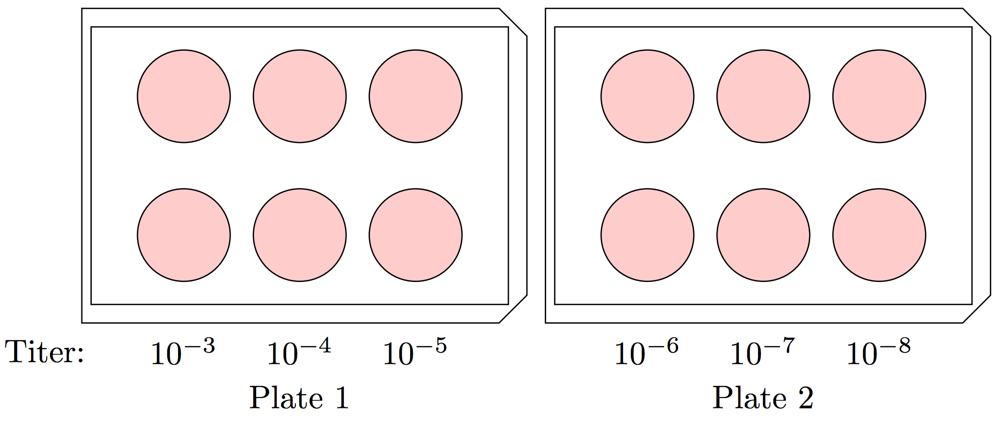
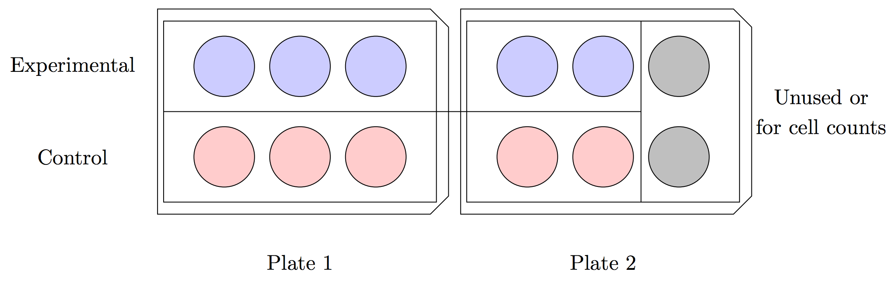

.. highlightlang:: rest

.. _procedures:

Common Lab Procedures
=====================

Procedure for Splitting MA104 Cells
-----------------------------------

**Items Needed:**

* :math:`1\times` PBS
* 0.05% Trypsin-EDTA
* Complete Medium 199
* :math:`150\text{cm}^2` flask

In a water bath, warm PBS, Trypsin, and complete Medium 199 to :math:`37^{\circ}`\ C. Transfer all materials into the biosafety cabinet. Tilt the flask with your cells (having formed a confluent monolayer) such that the culture medium runs towards the neck of the flask. Vacuum out all culture medium using a small glass (Pasteur) pipet connected to the rubber vacuum hose. Dispose of the pipet. To the cell culture, add 10mL :math:`1\times` PBS. Tilt the flask to ensure that all cells are thoroughly covered by PBS. Aspirate using a small glass pipet. Dispose of the pipet.

To the cell culture, add :math:`5`\ mL Trypsin, tilting the flask forward and back to ensure that the cells are fully bathed. Vacuum out the Trypsin with a small glass pipet. Add a second :math:`5`\ mL portion of Trypsin to the cell culture. Incubate at :math:`37^{\circ}`\ C until all cells have detached from the surface and are free-floating. (The solution in the flask will turn cloudy as cells detach. Detachment may be verified through the microscope.) Lightly tap the flask with your hand if any cells remain attached.

To the cell culture add :math:`15`\ mL complete Medium 199. (If you used less trypsin in the previous step, adjust the amount of Medium 199 applied such that there is :math:`20`\ mL solution in the flask.)

To each new flask that you wish to prepare, add complete Medium 199 such that the final flask volume after the cell mixture is added will be equal to :math:`25`\ mL. To determine the volume of cell mixture to add to each new flask, we use Table 1.1.

.. topic:: Table 1.1

	.. csv-table:: 
	   :header: "Cell Dilution Ratio", "Cell mix volume to add"
	   :widths: 25, 25

	   "1:2", "10mL"
	   "1:4", "5mL"
	   "1:8", "2.5mL"

    For example, if we wished to prepare one 1:4 dilution and two 1:8 dilutions, to our first flask we would add :math:`20`\ mL complete Medium 199 and :math:`5`\ mL cell mixture; to each of our second two flasks we would add :math:`22.5`\ mL complete Medium 199 and :math:`2.5`\ mL cell mixture.

Cap the new flask(s) and tilt forward and back to evenly spread the cells. Loosen the lids and incubate at :math:`37^{\circ}`\ C.

Procedure for Plating MA104 Cells
---------------------------------

**Items Needed:**

\item :math:`1\times` PBS
\item 0.05% Trypsin
\item Complete Medium 199
\item Trypan Blue
\item 6-well plates (x8)

In a water bath, warm PBS, Trypsin, and complete Medium 199 to :math:`37^{\circ}`\ C. Aspirate the cell culture medium from the flask. Wash the cell monolayer in :math:`10`\ mL :math:`1\times` PBS and aspirate from the flask. Wash the cell monolayer in 5mL trypsin and aspirate from the flask. Bathe the cell monolayer in :math:`5`\ mL trypsin and incubate at :math:`37^{\circ}`\ C until all cells have detached from the flask. (Check every 2 minutes.) Tap the flask with your hand to detach any remaining cells.

To the flask add :math:`15`\ mL complete Medium 199 and mix thoroughly with the pipet. On a piece of parafilm, combine :math:`10\mu`\ L cell mixture and :math:`10\mu`\ L trypan blue. Mix thoroughly with a pipet. To a cell counter slide, add the :math:`20\mu`\ L solution such that the slide is completely filled with liquid. Insert into the automatic cell counter and record the result (total cells; live cells; percent alive). Use this to extrapolate the number of cells in the T150 flask and in each well as follow:

.. :math:
    :nowrap:

	\begin{align*}
	\frac{\text{cells}}{20\text{mL flask}} &= \frac{\text{cells}}{\text{mL}}\cdot \frac{20\text{mL}}{\text{flask}}\\
	\frac{\text{cells}}{150\text{mL conical vial}} &= \frac{\text{cells}}{20\text{mL flask}}/\frac{150\text{mL}}{\text{conical vial}}\\
	\frac{\text{cells}}{\text{well}} &= \frac{\text{cells}}{150\text{mL}}\cdot\frac{3\text{mL}}{\text{well}}
	\end{align*}

To a :math:`250`\ mL conical vial add :math:`130`\ mL complete Medium 199. Supplement this with :math:`20`\ mL cell solution. (These values may be halved if 4 plates are being prepared. A T75 flask can accommodate 4 6-well plates; a T150 flask 8 6-well plates.) Transfer the cell mix to each of the wells, adding :math:`3`\ mL cell solution per well. Spread the cells by tilting forward and back. Incubate the plates at :math:`37^{\circ}`\ C for several days.

Procedure for activating RV SA11 and Infecting MA104 Cells
----------------------------------------------------------

**Items Needed:**

*  SA11 stock
*  Trypsin (2mg/mL)
*  Serum-free Medium 199
*  :math:`2\times` EMEM
*  1.2% agarose

In a large Eppie tube combine :math:`400\mu`\ L rotavirus SA11 stock and :math:`2\mu`\ L trypsin. Cap and incubate in a :math:`37^{\circ}`\ C water bath for 1 hour. To each of 8 :math:`14`\ mL plastic tubes add :math:`2.7`\ mL serum-free Medium 199.

Add :math:`300\mu`\ L virus mix to the first tube and label as :math:`10^{-1}`\ . Mix the solution by vertex to homogenize. Take :math:`300\mu`\ L of the :math:`10^{-1}` solution and add to the second tube. Label :math:`10^{-2}`\ , cap, and mix by vertex. Repeat this process across the remaining tubes, ending with a viral concentration of :math:`10^{-8}`\ . Store in the :math:`4^{\circ}`\ C freezer if the cells are not going to be immediately infected. This is enough for 2 6-well plates. (Quantities may be increased proportionately if more than 2 plates are being infected at once.)

Wash each plate twice with serum-free Medium 199 by dumping. (See detailed procedure below.) To each plate add the rotavirus titers. Each titer is to be performed in duplicate. To achieve this, add :math:`\sim 1`\ mL of the :math:`10^{-8}` titer to two wells, then :math:`10^{-7}` titer to two wells, and so on. You will end with two plates as follow:

.. topic:: Detailed Procedure to Avoid Cell Dessication
	
	During the washing and infection steps, cells may dry out and die. To avoid this, we typically:
	
	#.  Prepare in a glass Pyrex bowl a small amount (:math:`0.5`\ cm deep) of bleach
	#.  Prepare one :math:`50`\ mL tube of serum-free M199
	#.  For one plate, flip upside down to dump cell culture medium into the bleach solution
	#.  Quickly pour into each well :math:`\sim 3`\ mL of serum-free M199 from the prepared vial (pour along the bottom edge of each well to make as little direct contact with the monolayer as possible while pouring)
	#.  Tilt the plate to gently wash the cells with the solution
	#.  Dump the culture medium into the bleach solution
	#.  Again pour into each well :math:`\sim 3`\ mL of serum-free M199 from the prepared vial and spread evenly
	#.  Uncap the 3 vials of viral titer that are to be used for the plate
	#.  Dump the culture medium into the bleach solution
	#.  Quickly pour :math:`\sim 1`\ mL of viral solution into each corresponding well
	#.  Label the plate cover with the titers used in each well and set the plate aside
	#.  Repeat the above steps sequentially for all remaining plates needing infection (a new tube of serum-free M199 should be used for each plate; the bleach solution may be reused across all plates)
	
	Here, it is important to both work quickly to ensure that cells do not dry out, but also carefully so that you do not pour M199 or viral inoculant into the wells too heavily, causing cells to wash away. If your plaque assays have sickle-shaped holes, this is likely due to cells having been washed away by heavy pouring. Likewise, large, irregular, blotchy holes are likely caused by cell drying. Generally, if you work too quickly, the halo of washed-away cells will appear; too slowly and the cells will dry out. If you're having trouble finding a happy medium, err towards the sickles. These do not *necessarily* ruin a plaque assay whereas cell desiccation will generally render the entire assay unusable.

Incubate the plates at :math:`37^{\circ}`\ C for 1 hour.

Liquify a jar of :math:`1.2`\ % agarose using a microwave. Equilibrate the agarose to no more than :math:`55^{\circ}`\ C (hotter and the cells will be killed) and no cooler than :math:`37^{\circ}`\ C (the agarose will resolidify). Warm :math:`2\times` EMEM to :math:`37^{\circ}`\ C in a water bath. For each plate infected, prepare a solution of :math:`10`\ mL agarose, :math:`10`\ mL :math:`2\times` EMEM, and :math:`5\mu`\ L trypsin. (Add the EMEM first, followed by the trypsin, followed by the agarose. Do not add trypsin to hot agarose.)

One plate at a time, aspirate the viral inoculant. (You may use a new pipet for each well or may use one pipet per plate, aspirating from the lowest concentration well to highest. Tilt the plates downward towards you and keep the pipet along the lower edge of the well. Do not make contact between the pipet and the monolayer.) Quickly add to each well :math:`\sim 3`\ mL of the agarose solution. Place the lid on the well and allow it to sit, undisturbed, for approximately 30 to 45 minutes (until the agarose overlay has solidified). Incubate approximately 3 days at :math:`37^{\circ}`\ C.

Procedure for Performing RV Plaque Assay
----------------------------------------

**Items Needed:**

*  Neutral red
*  :math:`2\times` EMEM
*  1.2% Agarose

Liquefy 1.2% agarose by microwave. Equilibrate agarose to no more than :math:`55^{\circ}`\ C. For 4 6-well plates, mix :math:`15`\ mL :math:`2\times` EMEM, :math:`15`\ mL 1.2% agarose, and :math:`1.5`\ mL neutral red. Add :math:`1`\ mL solution to each well and allow it to solidify. Incubate the plates at :math:`37^{\circ}`\ C and count the plaques that have formed after :math:`4-24` hours of incubation.

Procedure for Transducing MA104 Cells with siRNA-Expressing Lentiviral Vectors
------------------------------------------------------------------------------

**Items Needed:**

*  1000x polybrene
*  Lentiviral vector
*  Non-silencing vector (control)
*  Complete M199
*  0.05% Trypsin
*  :math:`1\times` PBS
*  Trypan blue

This procedure should be performed when the plated MA104 cells are :math:`70-80`\ % confluent.

Select one well to use for a cell count. Aspirate the cell culture medium from this well. Add :math:`1`\ mL PBS, spread evenly, and aspirate. Add :math:`500\mu`\ L trypsin, spread evenly, and aspirate. Add :math:`500\mu`\ L trypsin, spread evenly, and incubate the plate at :math:`37^{\circ}`\ C until all cells have detached from the well.

To the well add :math:`1.5`\ mL complete M199 and mix well. Take :math:`10\mu`\ L cell mix and combine with :math:`10\mu`\ L trypan blue. Apply this mixture to a slide and determine the number of cells per mL. Normalize this to the number of cells per well. (I.e., double the cell count per mL for the :math:`2`\ mL cell solution in the target well.)

Calculate the dilution factor for the lentiviral vector by:

.. math::
    :nowrap:

	\begin{equation*}
	\left(\frac{\text{cells}}{\text{well}}\cdot \text{MOI}\right)/\left[\text{lentivirus}\right]
	\end{equation*}

For example, if there are :math:`1.86\times 10^5` cells per well, your original lentiviral concentration is :math:`2.13\times 10^9` particles per mL, and you want to transduce your cells with a multiplicity of infection (MOI) of :math:`10`\ :

.. math::
    :nowrap:

	\begin{align*}
	\text{dilution} &= \left(\frac{1.86\times 10^{5}\text{ cells}}{\text{well}}\cdot \frac{10\text{ particles}}{1\text{ cell}}\right)/\frac{2.13\times 10^{9}\text{ particles}}{\text{mL}} \\
	&= \frac{1.86\times 10^{6}\text{ particles}}{\text{well}}/\frac{2.13\times 10^{9}\text{ particles}}{\text{mL}} \\
	&= \frac{0.00087\text{mL}}{\text{well}} = \frac{0.87\mu\text{L}}{\text{well}}
	\end{align*}

Per well, prepare a solution of :math:`1`\ mL complete M199, :math:`1\mu`\ L polybrene (diluted by a factor of :math:`1000`\ ), and the calculated volume of lentiviral vector. Repeat this procedure for the control NSV.

Aspirate the cell culture medium from each control and experimental well. To the experimental wells, add with one pipet :math:`1`\ mL lentiviral solution to each well. To the control wells, add with a second pipet :math:`1`\ mL control solution to each well. The final plates, using for example :math:`5` control and :math:`5` experimental wells, may look similar to the following:

Typically, only biological triplicate is needed (the minimum number of data points to calculate standard deviation/error). More may be prepared, however, if desired. {\itshape If preparing only 3 experimental and control wells, respectively, be sure to make up a second plate of cells to be used exclusively for cell counts. Otherwise you'll be destroying your experimental and control wells. That's bad times.}

Incubate these plates for 2 hours at :math:`37^{\circ}`\ C. After 2 hours, supplement each of the experimental wells with :math:`2`\ mL complete M199. Using a second pipet, supplement each of the control wells with :math:`2`\ mL complete M199. The final volume of medium in each well should be :math:`3`\ mL. Incubate for 48 hours at :math:`37^{\circ}`\ C.

Procedure for Infecting Cells Following Lentiviral Transduction
---------------------------------------------------------------

**Items Needed:**

*  Serum-free M199
*  Complete M199
*  SA11 stock
*  0.05% Trypsin
*  Trypsin (:math:`2`\ mg/mL)
*  Trypan blue
*  :math:`1\times` PBS

Select one well to use for a cell count. Aspirate the cell culture medium from this well. Add :math:`1`\ mL PBS, spread evenly, and aspirate. Add :math:`500\mu`\ L :math:`0.05`\ % trypsin, spread evenly, and aspirate. Add :math:`500\mu`\ L :math:`0.05`\ % trypsin, spread evenly, and incubate the plate at :math:`37{^\circ}`\ C until all cells have detached from the well.

To the well add :math:`1.5`\ mL complete M199 and mix well. Take :math:`10\mu`\ L cell mix and combine with :math:`10\mu`\ L trypan blue. Apply this mixture to a slide and determine the number of cells per mL. Normalize this to the number of cells per well. (I.e., double the cell count per mL for the :math:`2`\ mL cell solution in the target well.)

Calculate the dilution factor for the SA11 stock by:

.. math::
    :nowrap:

	\begin{equation*}
	\left(\frac{\text{cells}}{\text{well}}\cdot \text{MOI}\right)/\left[\text{SA11}\right]
	\end{equation*}

For example, if there are :math:`2.36\times 10^5` cells per well, your original SA11 stock concentration is :math:`5\times 10^{7}` PFU per mL, and you want to infect your cells with a multiplicity of infection (MOI) of :math:`5`\ :

.. math::
    :nowrap:

	\begin{align*}
	% initial
	\text{[SA11]} &= \frac{5\times 10^{7}\text{ PFU}}{1\text{mL}}\\
	% MOI = 10
	\text{dilution}&= \left(\frac{2.36\times 10^{5}\text{ cells}}{\text{well}}\cdot \frac{5\text{ particles}}{1\text{ cell}}\right)/\frac{5\times 10^{7}\text{ PFU}}{1\text{mL}}\\
	&= \frac{23.6\mu\text{L}}{\text{well}}\\
	\end{align*}

Activate SA11 by combining :math:`400\mu`\ L SA11 stock and :math:`2\mu`\ L :math:`2`\ mg/mL trypsin. Incubate in a :math:`37^{\circ}`\ C water bath for 1 hour. Prepare a vial of SA11 diluted according to the equation above in serum-free M199. :math:`1`\ mL of solution will be applied to each well. It is recommended to prepare a single solution containing a volume sufficient for inoculation of all transduced wells.

Wash all transduced wells twice using serum-free M199 by dumping. Add to each well :math:`1`\ mL viral inoculant. Spread evenly by shaking and incubate for 1 hour at :math:`37^{\circ}`\ C.

Prepare a solution of :math:`3`\ mL serum-free M199 and :math:`0.75\mu`\ L :math:`2`\ mg/mL trypsin per well. Aspirate the viral inoculant from each well and replace with :math:`3`\ mL of the serum-free M199 solution just prepared. Spread evenly by shaking and incubate plates at :math:`37^{\circ}`\ C overnight.

Procedure for Lysing transduced Cells Following RV Infection
------------------------------------------------------------

Freeze transduced cells completely at :math:`-80^{\circ}`\ C for approximately 30 minutes.  (Depending on the number of plates, the exact time will vary. What is important is that all wells freeze completely.) Remove from freezer and allow to thaw. Refreeze cells overnight in :math:`-20^{\circ}`\ C freezer.

The following day, remove cells from the freezer and allow to thaw fully. Pipet the contents of each well into its own :math:`15`\ mL tube, cap tightly, and label. Use a new pipet for each solution transfer. Centrifuge the solutions at :math:`500\times`\ g for 10 minutes at :math:`4^{\circ}`\ C.

Collect the supernatant from each centrifuged solution in its own fresh tube. Cap, label, and store at :math:`-20^{\circ}`\ C until you are ready to activate the viral content and infect plated cells. The solutions may be stored at :math:`-80^{\circ}`\ C if no cells will be infected immediately.